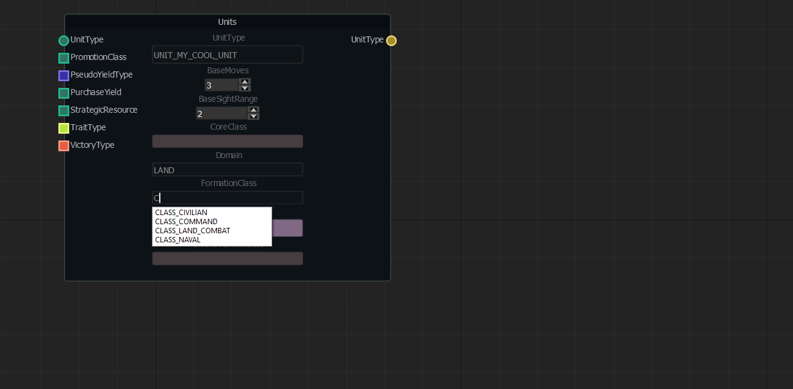
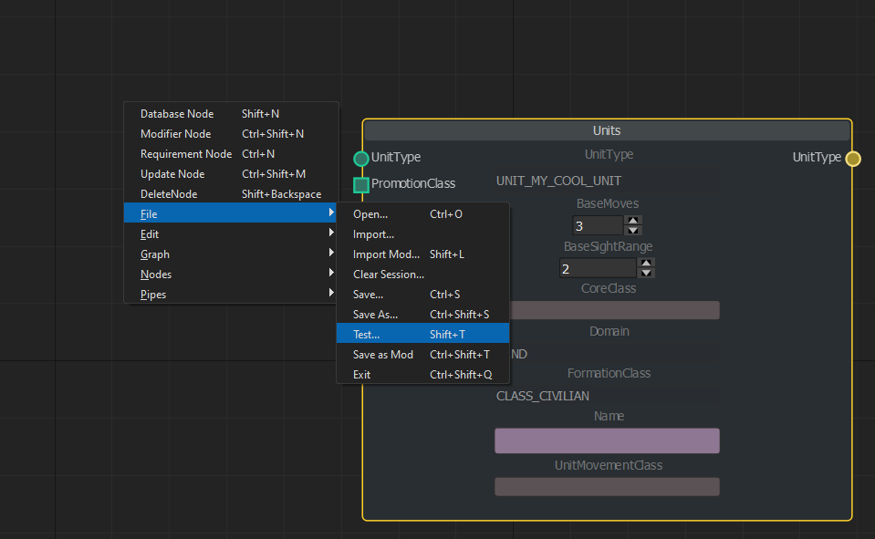
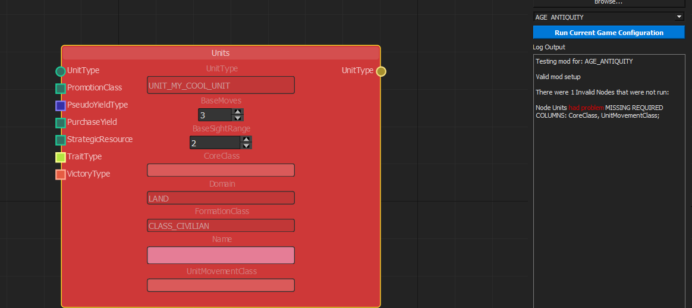
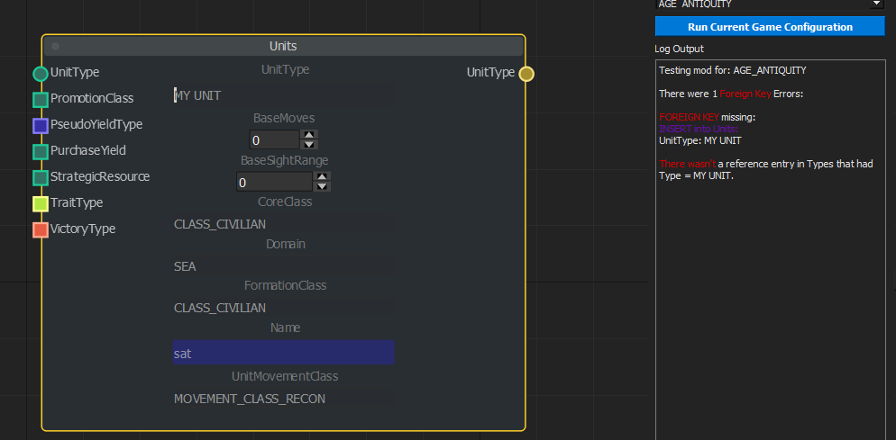
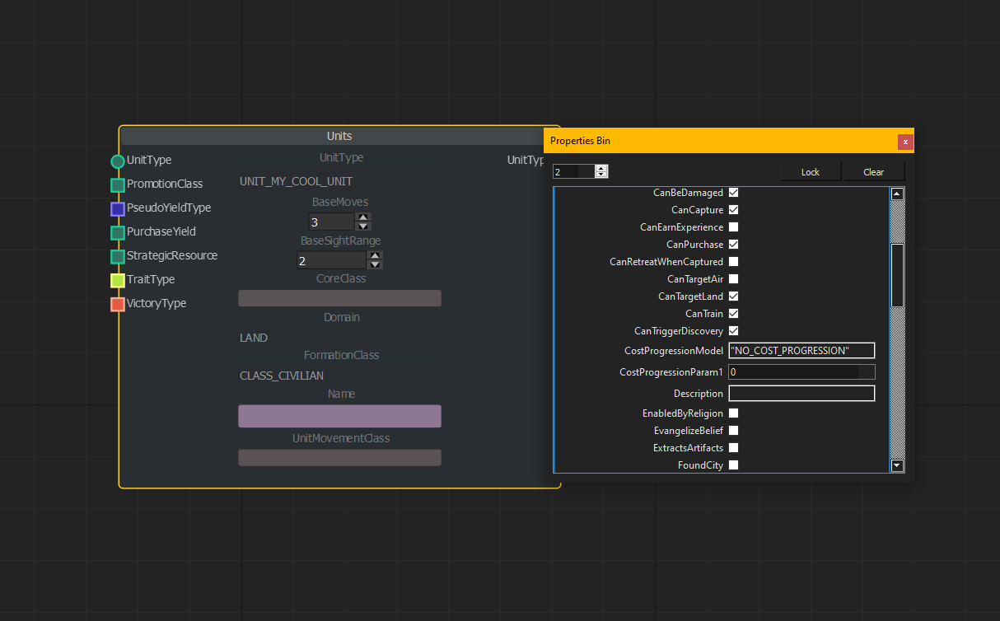
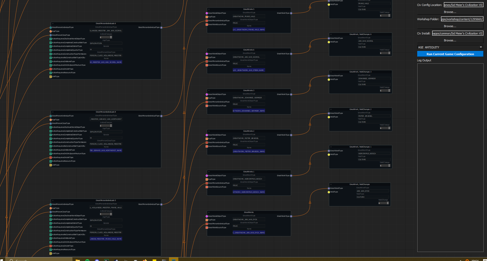

## Slothoth's DB Checker and Planner
This is a graph-based GUI modding tool for Civ VII. It uses your existing Steam installation to build a version of the Gameplay database that should be resilient to any patches.
# Features
- Visualise any entry for any table in the database whether it be Unit_Stats or Ages. Any columns that are invalid will be highlighted in red.
- Debug any existing mod configuration. If you aren't sure why your mod is failing to let you load into game, exit out, open the GUI, and click the blue button, Run Current Game Configuration. My program will extract the current configuration of mods and DLC you have on, and run them, single INSERTS at a time, finding any rejections.
- Import and visualise any existing mod. Simply go to Import Mod, then choose a folder with a .modinfo in it. The program will load all the mod content, and you can even choose which criteria are on, or off, if that matters to the mod.
- Visualise errors in a graph type format. Using the current setup of table nodes, you can Right Click > Test Mod and lint all the database entries, and if any foreign keys are violated. Any errors will be logged, and the offending entries highlighted in red. You can cycle through the erroring nodes.
- The node graph can be exported to a simple mod for playtesting. You can set metadata about the generated mod like Mod id, description, name etc.
- Possible foreign keys for a node are represented with Ports, which you can pull out to make a new node it references.
- Nodes also have advanced completions. Most every column that has a foreign key will let you select from existing values. Even those without foreign keys that are in a small range (like Domain) will give you those options.
- Completions are dynamic. So if I defined a Units node with UNIT_MY_UNIT.UnitType, it would be the top option in Unit_Stats.UnitType.
- Additional columns that can be left empty or have default values are editable in the properties of the node, accessible by double click.
- Non-insertion statements like UPDATE or DELETE are handled in their own node, which allows you to write your own SQL, and see the effects of that statement on the database state of that specific age.
- Localisation support is enabled. Fields in blue are fields that can be localised. Simply write the actual text you want to use and it will be converted into a LOC value when building the mod, and the LOC value will be inserted into the Localisation database under English.
- There are two custom nodes that combine tables for easier reference: GameEffects node that combines DynamicModifiers, Types, Modifiers, ModifierArguments and ModifierStrings. It dynamically lists all possible Argument Names that can be specified.
- There is also a custom Requirements Node that is a combination of Requirements and RequirementArguments. This can be linked to the Custom GameEffects node port to act as one of the Requirements in its RequirementSet
- You can copy and paste and do various other things in ordering the layout of the graph
- Foreign Key Connections are represented by Ports on the left and right of each Node. A right most port represents the Primary Key of that table, and where it might be used elsewhere. A left most port represents a Foreign key reference to another table. Common ports are coloured so you know which maps to which. Not required Foreign keys have square ports.
- Some additional virtual Foreign key connections have been added, where a table column always references another table, but there is no explicit foreign key.
# Future Agenda
- Currently the mod only allows loading one age at a time. In future, you will be able to have different graphs as different
tabs for different ages.

-I am likely going to implement custom nodes for Narratives, and for Units, and for Buildings. If you have any other
ideas for custom nodes, please suggest them.

- Additional columns in the PropertiesBinWidget on double click lack suggestions/completions. This will be fixed soon.
- UPDATE/DELETE statements do not alter suggestion lists. So if i deleted UNIT_WARRIOR, it would still show up in Unit_Stats.UnitType
- UPDATE/DELETE statements do not have a priority/chronology. If you updated UNIT_WARRIOR to have 5 BaseMovement, then in another node, tried to increase the sight range of units with 5 movement, UNIT_WARRIOR would not be included.
- There is no current option for viewing the state of the game with mods on, so you could mod on top of that. This will be a later feature.
- The dropdown suggestor when making a new Node is sorted alphabetically. In future, this will be more dynamic based on what tables are inserted into often (not Ages!), I may even have tailored suggestions based on your activity/what nodes you have already.
- Ports are sorted so required ones are at the top.
- The program can hang a little on start up as it is setting up the necessary content from your steam install for displaying graphs. In future, there will probably be a little loader.
- Current graph layouting makes nodes way too far apart. I plan to adjust this to make them closer.
- An About window explaining all the features.
- Property viewer window shows the current SQL that the node will generate.
- Nodes currently have a lot of unused space caused by the columns on ports. Plan to use this.
- There are some missing effect types, where the effect has no examples yet in the database. Should we handle this for suggestions, or ignore as often are defunct.
- How do we handle it if they are imported?
- 
# Future Big Features
- Image imports for Civ/Unit Icons
- A version for Civ VI.
- Tabbed graphs, so you can see content in different criteria, and frontend
- Big Graphs compress tables of the same type into one node.
- Use information about the attached table on a modifier and the collection used to infer viable RequirementTypes and EffectTypes.
- 
# Known bugs
- Can double click when making new node to get two
- not a bug, but writing with shift toggles a mode in graph which is pain
- some Virtual foreign key additions were missed. UnitAbilities has no link to Types.
- redraw on breaking port connections from arg change looks weird
- The side panel is weird, button is too far out, doesn't minimise properly
- sometimes drawing connections to a valid port still causes dropdown to appear

